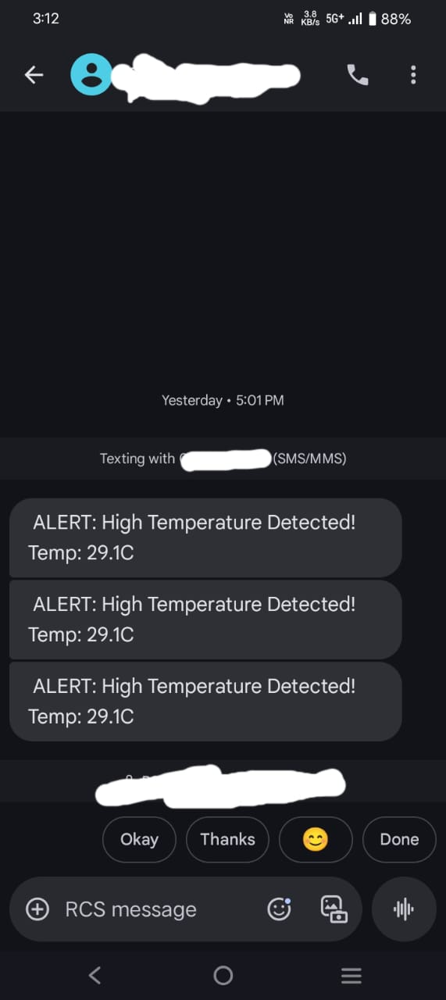

# 🔥 Smart Temperature Alert System using ESP32 + SIMCOM 4G + MQTT + SMS

> 📡 Real-time temperature monitoring with **MQTT publishing**, **SMS alert**, and **local alerts** (LED + Buzzer) using DHT11 sensor and ESP32 connected to SIMCOM 4G LTE — **without Wi-Fi**!

---

## 📷 Project Overview

This system continuously monitors ambient temperature and responds intelligently:
- Sends **SMS alerts** when unsafe temperature is detected.
- Publishes real-time status to **MQTT Broker** via **4G LTE** (no Wi-Fi).
- Activates **LED** and **buzzer** for local alerts.
- Prevents SMS spamming by applying a resend delay.

---

## 🧰 Hardware Used

| Component      | Description                            |
|----------------|----------------------------------------|
| ESP32          | Microcontroller with UART support      |
| DHT11          | Digital Temperature Sensor             |
| SIMCOM A7672S  | 4G LTE Module (AT Command Supported)   |
| LED            | Alert Indicator                        |
| Buzzer         | Audible Alert                          |
| Jumper Wires   | For connections                        |
| Power Supply   | USB / Battery                          |

---

## ⚙️ Features

- 🌡️ Real-time temperature sensing via **DHT11**
- 🚨 If temperature > 29°C → SMS alert + LED & Buzzer ON
- 📡 MQTT publishing over **4G LTE**
- ⏱️ SMS alert only once every 60 seconds (if unsafe)
- ✅ Status display on Serial Monitor

---

## 🧾 How It Works

1. ESP32 reads temperature from DHT11.
2. If temperature > 29°C:
   - LED & buzzer blink 6 times
   - Sends SMS:  
     `"🚨 ALERT: High Temperature Detected! 🌡️ Temp: XX.X°C 🌡️"`  
     to phone number `+91XXXXXXXXXX`
   - Publishes:
     - `navz/temp` = temperature value
     - `navz/led` = "ON"
     - `navz/buzzer` = "ON"
3. Else:
   - Turns off LED & buzzer
   - Publishes `OFF` status to MQTT
   - Resets SMS trigger

---

## 🛠️ Arduino Code

Main code is available in [`SmartTempAlert.ino`](./SmartTempAlert.ino)

### Key Functions:
- `sendSMS(number, message)` → Sends alert via SIMCOM
- `setupGPRS()` → Initializes SIMCOM 4G internet
- `publishMQTT(topic, payload)` → Sends MQTT packets using AT commands

---

## 🌐 MQTT Broker Info

- **Broker**: [HiveMQ](https://www.hivemq.com/public-mqtt-broker/)
- **Address**: `tcp://broker.hivemq.com:1883`
- **Client ID**: `navzclient`
- **Topics**:
  - `navz/temp`
  - `navz/led`
  - `navz/buzzer`

---

## 📸 SMS Screenshot

> Below is a real SMS received when temperature exceeds threshold:

---

## 📝 Future Improvements

- Replace DHT11 with DHT22 or BMP280 for better accuracy
- Add timestamp to SMS (using RTC or SIM module’s time)
- Secure MQTT with TLS
- Integrate Node-RED UI for live dashboard

---

## 🙋 Author

**Naveen Kumar S**  
📍 Coimbatore, India  
🔗 [GitHub: Navz360](https://github.com/Navz360)  
📧 naveenkumarork@gmail.com 

---

## 📜 License

This project is licensed under the [MIT License](LICENSE).

